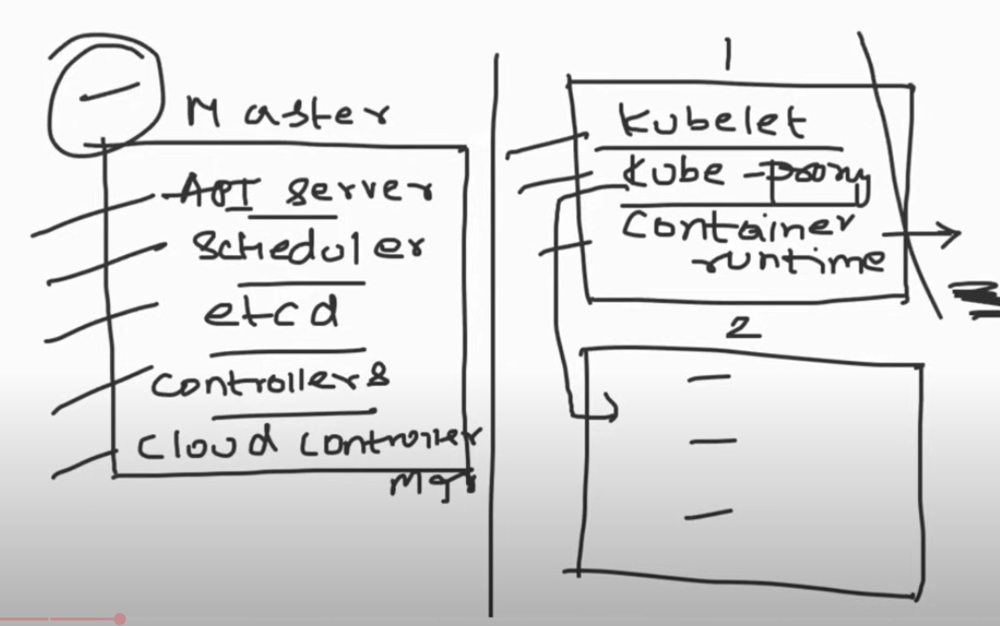

## Day 1:

Containers are ephimeral, something that is short living in nature. 100 containers running on a machine get affected by each container's resource utilizations.

Problems with docker:

1. the nature of docker is scoped to _one single host_, therefore, one container can impact other
2. Lack of _auto-healing_, where without user's manual intervention, the container should start itself
3. Lack of _auto-scaling_ : as soon as the load gets increased, either you manually increase the number of container and stop them when load decreases or it should handle automatically, apart from this, we have to configure load-balancing
4. Docker is a simple platform, it does not suppot any of the enterprise level support like load-balancers, firewall, autoscaling, autoheal, api-gateways.

Kubernetes solves all of the above listed problems

By default kubernetes is a cluster, a group of nodes, it is a master node architecture. There's one master and multiple nodes.

Kubernetes has replica sets, this is what's responsible for auto-healing, it also supports something called hpa (horizontal pod autoscaler) this caters auto-scaling.

Whenever kubernetes recieves a request that the container is going down, it immediately rolls out a new container or pod (a k8s term)

kubernetes is backed up by cncf

## Day 2:

### k8s architecture:

Kubernetes has something called control plane (API server, etcd, scheduler, controller manager, cloud controller manager) and data plane (kubelet, kubeproxy, container runtime)

Let's say there's one master and one worker, now every request goes to this master (control plane) and then worker (data plane).

The smallest level of deployment in kubernetes is pod, in docker it's container. Pod is just like a wrapper over the container which has some advanced capabilities

We'll understand the architecture of kubernetes by understanding what happens when a pod is created in kubernetes

let's say we run a pod on the worker

1. Worker node components (data plane components)

   1. kubelet : responsible for running our pod, if the pod is not running, kubelet is responsible for informing the master.

   2. container-runtime: To run the pod, it requires container runtime. egs: dockershim, containerd, crio. These implements container interface

   3. kube-proxy: provides us networking, every pod we are creating has to be associated with an ip-address and it has to be provided with load balancing capabilities.

2. Master node components (control plane components)

   1. Api server: it exposes our kubernetes, all the kubernetes components we have discussed are internal working of kubernetes. It takes all the request from the external world

   2. Scheduler: responsible for scheduling our resources on kubernetes. It acts on the information recieved from the api-server.

   3. etcd: key-value store which stores entire kubernetes cluser information is stored inside it. If we want to restore the cluster, without etcd, it's not possible.

   4. Controller Manager: This ensures that some components like replica-set are always running. Replica set ensures that if requested in yaml, the 2 pods are always running.

   5. Cloud Controller Manager: kubernetes can be deployed on cloud platforms like AWS, the request to create a load balancer or the request to create storage, kubernetes needs to understand the underlying cloud provider to execute these. That is done by ccm. If we are running kubernetes on-premise, there's no need for this component.

